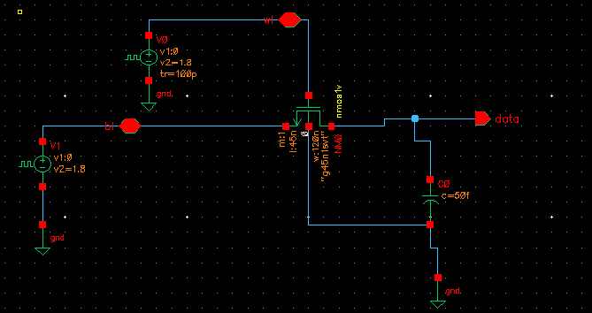

# DRAM Design using CMOS VLSI in Cadence Virtuoso

## Overview

This project presents the CMOS VLSI implementation and simulation of a **Dynamic Random Access Memory (DRAM)** cell using **Cadence Virtuoso**.

The DRAM design demonstrates:
- Dynamic data storage using capacitor-based memory
- Access transistor operation
- Read and Write functionality
- DC Analysis
- Transient Analysis

The project is implemented and simulated using:
- Cadence Virtuoso
- Spectre Simulator
- CMOS Technology Library

---

# Project Structure

```bash
CMOS-VLSI/
│
├── DRAM/
│   │
│   ├── dram.PNG
│   ├── dram timing diagram.PNG
│   ├── DRAM DC Analysis.png
│   └── README.md
```

---

# DRAM Cell Architecture

The designed DRAM cell consists of:
- 1 Access NMOS Transistor
- 1 Storage Capacitor

This configuration forms a basic **1T1C DRAM Cell**.

---

# DRAM Schematic

## 1T1C DRAM Cell



---

# Internal Components

| Component | Function |
|-----------|----------|
| NMOS Transistor | Access Device |
| Capacitor | Charge Storage |
| WL | Word Line |
| BL | Bit Line |
| Data Node | Stored Data |

---

# Working Principle

## Write Operation

- Word Line (`WL`) is enabled
- Data is applied through Bit Line (`BL`)
- Access transistor turns ON
- Capacitor charges/discharges according to input data

---

## Read Operation

- Word Line (`WL`) is enabled
- Stored capacitor charge appears on data node
- Data can be sensed through Bit Line

---

# Transient Analysis

Transient analysis verifies:
- Charging and discharging behavior
- Dynamic storage capability
- Read/Write operation timing
- Capacitor retention characteristics

---

## Timing Diagram


---

# Transient Analysis Observations

- Word Line pulses correctly enable access transistor
- Data node follows Bit Line during write operation
- Capacitor retains charge temporarily
- Dynamic storage operation verified successfully

---

# DC Analysis

DC analysis is performed to analyze:
- Voltage transfer characteristics
- Capacitor charging behavior
- Node voltage variation
- Stability characteristics

---

## DC Analysis Graph


---

# DC Analysis Observations

- Data node voltage varies according to Bit Line voltage
- Proper transistor switching observed
- Dynamic memory storage characteristics verified
- Capacitor charging behavior analyzed successfully

---

# Design Parameters

| Parameter | Value |
|-----------|-------|
| Memory Type | DRAM |
| Cell Type | 1T1C |
| Technology | CMOS |
| Supply Voltage | 1.8V |
| Capacitor Value | 50fF |
| Simulator | Spectre |

---

# Tools Used

| Tool | Purpose |
|------|---------|
| Cadence Virtuoso | CMOS Circuit Design |
| Spectre Simulator | Analog Simulation |
| CMOS Technology Library | Device Modeling |
| VMware | Virtual Environment |

---

# Simulations Performed

- Schematic Design
- DC Analysis
- Transient Analysis
- Read Operation
- Write Operation
- Dynamic Charge Storage Verification

---

# Applications

- Main Memory Systems
- High Density Memory Arrays
- Embedded Systems
- Low Power Memory Design
- VLSI Memory Architectures

---

# Future Improvements

- DRAM Array Design
- Refresh Circuit Implementation
- Sense Amplifier Design
- Layout Design
- DRC/LVS Verification
- Low Power Optimization

---

# Author

**Gaurav Kumar**

---

# License

This project is developed for educational and academic purposes.
