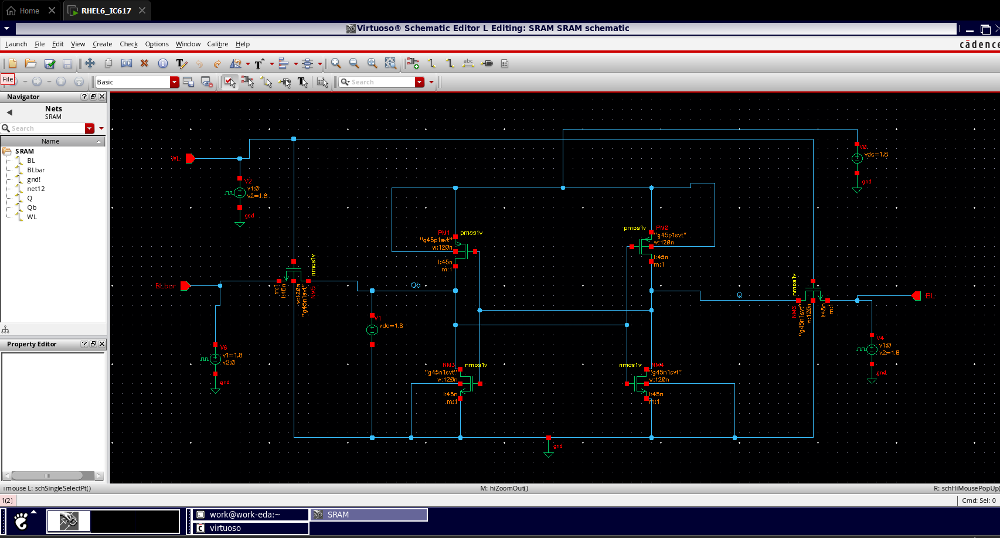

# 6T SRAM Cell Design using CMOS VLSI in Cadence Virtuoso

## Overview

This project presents the design and simulation of a **6-Transistor (6T) SRAM Cell** using **CMOS VLSI Design** in **Cadence Virtuoso**.

The SRAM cell is implemented using:
- CMOS pull-up and pull-down transistor pairs
- Cross-coupled inverter architecture
- Access transistors controlled through Word Line (WL)

The project includes:
- SRAM Schematic Design
- Transient Analysis
- DC Analysis
- Read/Write Operation Verification

---

# Project Structure

```bash
CMOS-VLSI/
│
├── SRAM/
│   │
│   ├── 6TSRAM.png
│   ├── 6T SRAM Cell.png
│   ├── 6T SRAM Transient Analysis.png
│   ├── 6TSRAM DC Analysis.png
│   └── README.md
```

---

# 6T SRAM Cell Architecture

The designed SRAM cell uses:
- 2 PMOS transistors
- 2 NMOS pull-down transistors
- 2 Access NMOS transistors

The cell stores 1-bit data using cross-coupled inverters.

---

# SRAM Cell Schematic

## 6T SRAM Cell



---

# SRAM Internal Structure

The SRAM cell contains:

| Component | Function |
|-----------|----------|
| PMOS Pair | Pull-up Network |
| NMOS Pair | Pull-down Network |
| Access Transistors | Read/Write Access |
| WL | Word Line |
| BL | Bit Line |
| BLbar | Complementary Bit Line |

---

# Working Principle

## Write Operation

- Word Line (`WL`) is enabled
- Data is applied on:
  - `BL`
  - `BLbar`
- Access transistors conduct
- Cross-coupled inverters store data

---

## Read Operation

- `WL` is enabled
- Stored node values affect:
  - `BL`
  - `BLbar`
- Sense amplifiers can detect stored data

---

# Transient Analysis

Transient analysis verifies:
- Write operation
- Read operation
- Data retention
- Node switching behavior

---

## Transient Waveform


---

# Transient Analysis Observations

- `Q` and `Qb` are complementary
- Proper switching occurs during write operation
- Stable data retention is observed
- Word Line pulses correctly control access transistors

---

# DC Analysis

DC analysis is performed to evaluate:
- Stability
- Noise Margin
- Switching Threshold
- Butterfly Curve Characteristics

---

## DC Analysis Graph


---

# DC Analysis Observations

- SRAM cell exhibits bistable behavior
- Proper inverter crossover point observed
- Stable memory states verified
- Noise margin characteristics analyzed

---

# Tools Used

| Tool | Purpose |
|------|---------|
| Cadence Virtuoso | CMOS VLSI Design |
| Spectre Simulator | Circuit Simulation |
| CMOS Technology Library | Transistor Modeling |
| VMware | Virtual Environment |

---

# Design Parameters

| Parameter | Value |
|-----------|-------|
| Technology | CMOS |
| Supply Voltage | 1.8V |
| SRAM Type | 6T SRAM |
| Cell Size | 1-bit |
| Simulator | Spectre |

---

# Simulations Performed

- Schematic Verification
- DC Analysis
- Transient Analysis
- SRAM Read Operation
- SRAM Write Operation
- Stability Verification

---

# Applications

- Cache Memory
- Embedded Systems
- Low Power Memory Design
- High Speed SRAM Arrays
- VLSI Memory Systems

---

# Future Improvements

- SRAM Array Design
- Sense Amplifier Integration
- Layout Design
- DRC/LVS Verification
- Low Power SRAM Optimization
- SRAM Compiler Design

---

# Author

**Gaurav Kumar**

---

# License

This project is developed for educational and academic purposes.
