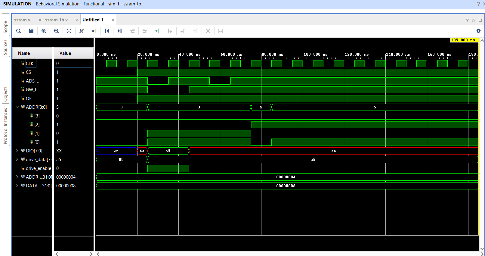
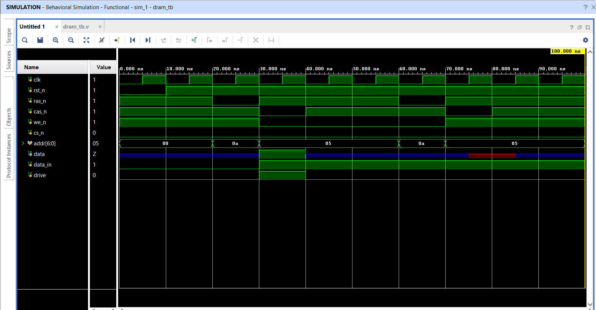

# SRAM and DRAM Design using Verilog HDL and CMOS VLSI

## Overview

This repository contains the implementation, simulation, and analysis of **SRAM (Static Random Access Memory)** and **DRAM (Dynamic Random Access Memory)** using:

- Verilog HDL
- CMOS VLSI Design
- Cadence Virtuoso
- Xilinx Vivado

The project demonstrates:
- Digital memory modeling
- RTL Design and Simulation
- CMOS Circuit Design
- SRAM and DRAM Cell Analysis
- Timing Verification
- DC and Transient Analysis

The repository is divided into:
- **Verilog-based Memory Design**
- **CMOS VLSI-based Memory Design**

---

# Repository Structure

```bash
SRAM-and-DRAM/
│
├── CMOS VLSI/
│   │
│   ├── SRAM/
│   │   ├── 6TSRAM.png
│   │   ├── 6T SRAM Cell.png
│   │   ├── 6T SRAM Transient Analysis.png
│   │   ├── 6TSRAM DC Analysis.png
│   │   └── README.md
│   │
│   ├── DRAM/
│   │   ├── dram.PNG
│   │   ├── dram timing diagram.PNG
│   │   ├── DRAM DC Analysis.png
│   │   └── README.md
│   │
│   └── README.md
│
├── Verilog/
│   │
│   ├── SRAM/
│   │   ├── ssram.v
│   │   ├── ssram_tb.v
│   │   ├── ssram.vcd
│   │   ├── schematic.png
│   │   ├── simulation.png
│   │   ├── simulation2.png
│   │   └── README.md
│   │
│   ├── DRAM/
│   │   ├── dram_16k_x1.v
│   │   ├── dram_tb.v
│   │   ├── dram.vcd
│   │   ├── schematic.png
│   │   ├── simulation.png
│   │   └── README.md
│   │
│   └── README.md
│
└── README.md
```

---

# Project Domains

## Verilog HDL Design

The Verilog section includes:
- Behavioral Modeling
- RTL Design
- Simulation using Vivado
- Waveform Verification
- Testbench Implementation

### Modules Included

| Module | Description |
|--------|-------------|
| SRAM | Synchronous SRAM Design |
| DRAM | 16K × 1 DRAM Design |

---

# CMOS VLSI Design

The CMOS VLSI section includes:
- SRAM Cell Design
- DRAM Cell Design
- DC Analysis
- Transient Analysis
- Cadence Virtuoso Simulations

### Designs Included

| Design | Description |
|--------|-------------|
| 6T SRAM Cell | CMOS SRAM Memory Cell |
| 1T1C DRAM Cell | Dynamic Memory Cell |

---

# SRAM Design Highlights

## Verilog SRAM
- 4-bit Address Bus
- 8-bit Data Bus
- Bidirectional Data Line
- Read and Write Operations
- Registered Output Logic

---

## CMOS SRAM
- 6T SRAM Architecture
- Cross-Coupled Inverters
- Read/Write Verification
- Stability Analysis
- DC and Transient Analysis

---

# DRAM Design Highlights

## Verilog DRAM
- 16K × 1 Memory
- RAS/CAS Addressing
- Dynamic Memory Modeling
- Read/Write Simulation

---

## CMOS DRAM
- 1T1C DRAM Cell
- Capacitor-Based Storage
- Dynamic Charge Storage
- Timing Analysis

---

# Tools and Technologies

| Tool | Purpose |
|------|---------|
| Verilog HDL | Digital Design |
| Xilinx Vivado 2025.2 | RTL Simulation |
| Cadence Virtuoso | CMOS VLSI Design |
| Spectre Simulator | Analog Simulation |
| GTKWave | Waveform Visualization |
| VMware | Virtual Machine Environment |

---

# Simulations Performed

## Verilog Simulations
- Behavioral Simulation
- Read/Write Verification
- Waveform Analysis
- RTL Elaboration

---

## CMOS Simulations
- DC Analysis
- Transient Analysis
- Stability Verification
- Timing Analysis

---

# SRAM CMOS Results

## 6T SRAM Cell


---

## SRAM Transient Analysis


---

## SRAM DC Analysis


---

# DRAM CMOS Results

## DRAM Cell


---

## DRAM Timing Analysis


---

## DRAM DC Analysis


---

# Verilog Simulation Results

## SRAM Simulation



---

## DRAM Simulation



---

# Applications

- Cache Memory Systems
- Embedded Systems
- FPGA Design
- VLSI Memory Design
- Computer Architecture
- Digital Electronics
- Memory Array Design

---

# Future Improvements

- SRAM Array Design
- DRAM Refresh Logic
- DDR/SDRAM Architecture
- Layout Design
- DRC/LVS Verification
- FPGA Hardware Implementation
- Low Power Optimisation

---

# Author

## Gaurav Kumar

### Contact Information

- Email: contact.sharag02@gail.com
- LinkedIn: https://www.linkedin.com/in/sharmag02
- GitHub: https://github.com/sharmag02
- Portfolio: https://sharmag02.netlify.app

---

# Contributions

Contributions, suggestions, and discussions are welcome.

Feel free to:
- Open Issues
- Suggest Improvements
- Report Bugs
- Fork the Repository
- Create Pull Requests

---

# License

This project is developed for educational and academic purposes.
