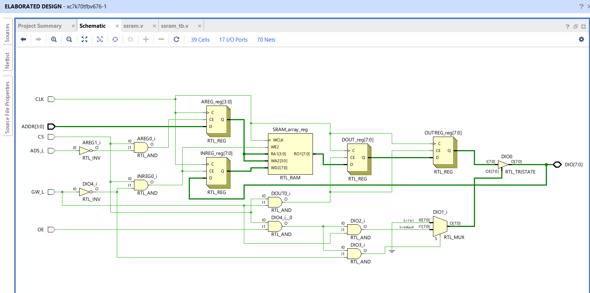
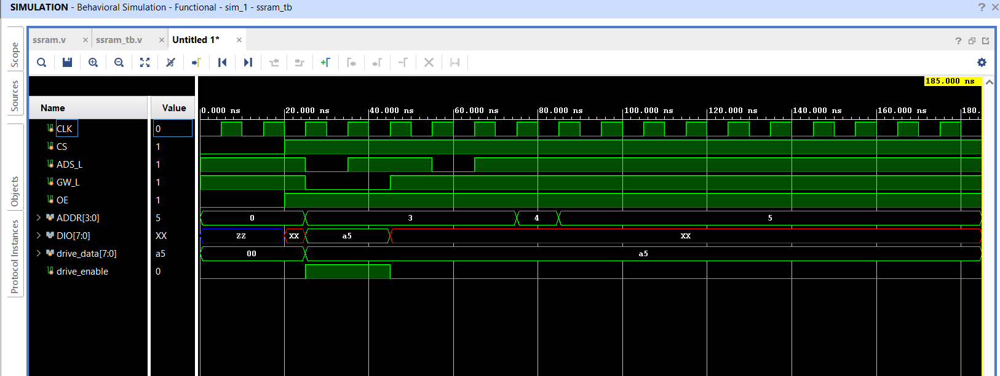

# SRAM Design and Verification using Verilog

## Overview

This project presents the design and behavioral simulation of a **Synchronous Static Random Access Memory (SRAM)** using **Verilog HDL** in **Xilinx Vivado**.

The SRAM supports:
- Synchronous Read and Write Operations
- Bidirectional Data Bus (`DIO`)
- Address Latching
- Output Enable Control
- Tri-state Bus Control

The design is verified using a custom Verilog Testbench and waveform simulation.

---

# Features

- 4-bit Address Bus
- 8-bit Data Bus
- 16 Memory Locations
- Synchronous Operation using Clock
- Bidirectional Data I/O
- Separate Read and Write Control
- Behavioral Simulation using Vivado
- VCD Waveform Generation

---

# Project Structure

```bash
SRAM/
│
├── ssram.v               # SRAM RTL Design
├── ssram_tb.v            # Testbench
├── ssram.vcd             # Simulation Waveform Dump
├── schematic.png         # RTL Schematic
├── simulation.png        # Simulation Waveform 1
├── simulation2.png       # Simulation Waveform 2
└── README.md             # Project Documentation
```

---

# SRAM Architecture

The RTL schematic generated from Vivado elaborated design is shown below.

## RTL Schematic



---

# SRAM Specifications

| Parameter | Value |
|-----------|-------|
| Address Width | 4-bit |
| Data Width | 8-bit |
| Memory Depth | 16 Words |
| Clock Type | Synchronous |
| Read Operation | Registered |
| Write Operation | Registered |
| Bus Type | Bidirectional |

---

# Input and Output Signals

| Signal | Direction | Description |
|--------|-----------|-------------|
| CLK | Input | System Clock |
| CS | Input | Chip Select |
| ADS_L | Input | Address Strobe (Active Low) |
| GW_L | Input | Global Write Enable (Active Low) |
| OE | Input | Output Enable |
| ADDR | Input | Address Bus |
| DIO | Inout | Bidirectional Data Bus |

---

# Internal Registers

| Register | Description |
|----------|-------------|
| AREG | Address Register |
| CREG | Control Register |
| INREG | Input Data Register |
| OUTREG | Output Data Register |
| DOUT | Internal Read Data |

---

# Functional Operation

## Write Operation

During write operation:

- `CS = 1`
- `GW_L = 0`
- Address is latched into `AREG`
- Input data from `DIO` is stored into memory

### Write Flow

```text
DIO → INREG → SRAM_array[AREG]
```

---

## Read Operation

During read operation:

- `CS = 1`
- `GW_L = 1`
- Data is fetched from memory
- Data is driven onto `DIO`

### Read Flow

```text
SRAM_array[AREG] → DOUT → OUTREG → DIO
```

---

# Simulation Results

The behavioral simulation was performed using Xilinx Vivado.

---

## Waveform Result 1


### Observations

- Address `0011` is selected
- Data `0xA5` is written into SRAM
- Clock synchronized write operation is successful
- Tri-state behavior is visible during transitions

---

## Waveform Result 2



### Observations

- Read operation is performed after write
- Stored data is successfully retrieved
- Address transitions are verified
- Bidirectional bus operation works correctly

---

# Testbench Verification

The testbench performs:

- Clock Generation
- SRAM Initialization
- Write Transaction
- Read Transaction
- Additional Address Verification
- VCD Dump Generation

---

# Simulation Steps

## Run in Vivado

### Step 1
Open Vivado Project.

### Step 2
Add:
- `ssram.v`
- `ssram_tb.v`

### Step 3
Run:

```text
Flow Navigator → Simulation → Run Behavioral Simulation
```

### Step 4
Observe waveform outputs.

---

# VCD Waveform Support

The project generates:

```text
ssram.vcd
```

This file can be opened using:
- GTKWave
- Vivado Waveform Viewer
- ModelSim

---

# Tools Used

| Tool | Purpose |
|------|---------|
| Verilog HDL | Hardware Description |
| Xilinx Vivado 2025.2 | Design & Simulation |
| GTKWave | Waveform Visualization |

---

# Applications

- Cache Memory Systems
- Embedded Systems
- FPGA-based Memory Controllers
- High-Speed Buffer Storage
- Digital System Design

---

# Future Improvements

- Asynchronous SRAM Design
- Byte Write Enable Support
- Burst Read/Write
- Dual-Port SRAM
- Low Power Optimization
- FPGA Hardware Implementation

---

# Author

**Gaurav Kumar**

---

# License

This project is developed for educational and academic purposes.
